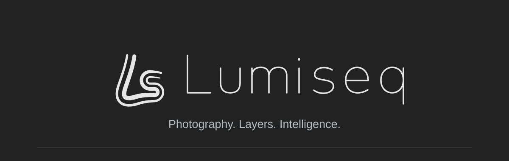
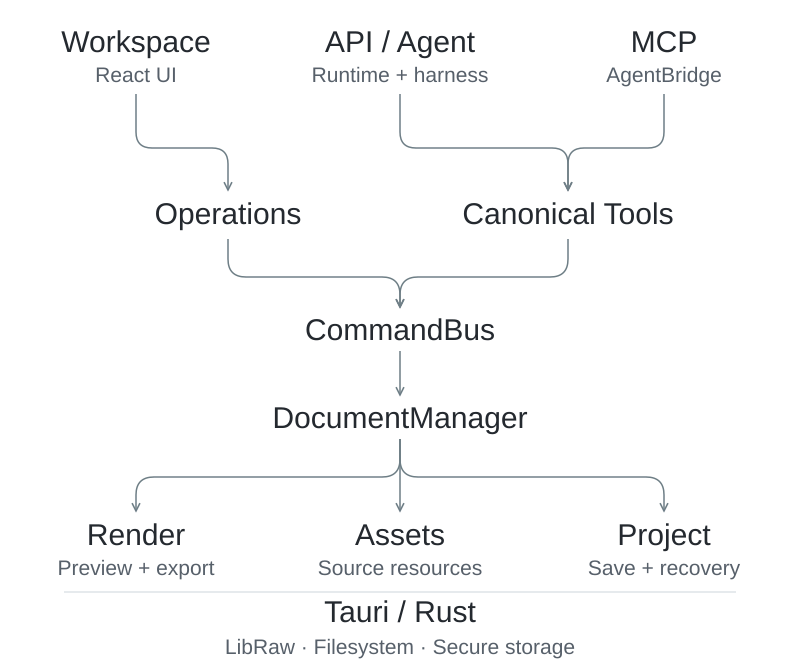

面向 Windows 的照片调色与分层图像编辑软件，支持 API 助手与本机 Agent。

**简体中文** · [English](README.en.md)

[下载与安装](#下载与安装) · [功能](#功能) · [架构](#架构) · [使用文档](docs/README.md) · [更新记录](CHANGELOG.md)

## 下载与安装

[**下载 Lumiseq 0.9.7 · Windows x64**](https://github.com/ky1rie1/Lumiseq/releases/tag/v0.9.7)

推荐下载 `Lumiseq-0.9.7-windows-x64-setup.exe`：安装包包含应用所需 DLL，并检测 WebView2 Runtime；缺失时调用微软引导程序安装，首次配置 Runtime 需要联网。无需 Node.js 或 Rust。

已有 [WebView2 Runtime](https://developer.microsoft.com/en-us/microsoft-edge/webview2/#download-section) 时，也可使用便携 ZIP。**完整解压后**运行 `lumiseq.exe`，保留同目录的 `WebView2Loader.dll`。

若提示“找不到 WebView2Loader.dll”，请恢复应用包中的 DLL；重新安装 Runtime 无法补齐它。[启动故障排查](docs/TROUBLESHOOTING.md)。

[发布页](https://github.com/ky1rie1/Lumiseq/releases/latest)附带第三方许可与 SHA-256 校验清单。当前程序未做代码签名。本地抠图模型已随程序打包；AI 助手需要在设置中连接自己的 API 或兼容的本机客户端。

## 功能

### RAW 调色

使用 LibRaw 解码相机原片，支持曝光、白平衡、HSL、曲线与局部调整，以及全图去雾、小波降噪和锐化。按原始分辨率导出 PNG16 或 JPEG8。

预设、快照和模块参数复制用于处理一组照片；曲线支持数字输入与方向键微调，连续拖动只产生一次撤销记录。重开 RAW 工程时，需要保留原始相机文件。

### 图像编辑

图层与嵌套分组、混合模式、选区、蒙版、画笔和修饰工具。支持图层复制、锁定、对齐、翻转，以及可修改和排序的智能对象滤镜。

自动抠图与边缘精修在同一界面中完成，可离线运行。原生工程保存图层与资源；PSD 导入导出的支持范围见 [兼容说明](docs/PSD_COMPATIBILITY.md)。首页、图像编辑与 RAW 调色之间切换时，已打开的文档保留在标签栏。

### AI 协作

应用内聊天可连接自选 API，或兼容的 Codex、Claude Code、Antigravity 本机客户端。外部 Agent 也可以通过 MCP 操作软件；具体连接方式与图片通道能力见 [连接指南](docs/PROVIDERS.md)。

AI 先查看整图，再按原图坐标检查局部与 1:1 细节。修改使用与界面相同的编辑命令，支持撤销；操作后核对参数和前后效果。探索模式提供原稿与最多两个渲染候选，用户可选择结果并保存摄影或排版偏好。

[AI 操作与观察接口](docs/MCP.md) · [安全与隐私](SECURITY.md)

## 架构

React 提供工作区，Tauri / Rust 负责原生能力。界面调用操作服务，AI 与 MCP 调用规范工具；文档修改经过 `CommandBus`，更新 `DocumentManager` 管理的状态，再供渲染、资源与工程存储使用。

<picture>
  <source media="(prefers-color-scheme: dark)" srcset="docs/assets/readme-architecture-dark.svg" />
  
</picture>

RAW 参数、图层和蒙版属于工程数据。AI harness 提供操作指南、观察预算、文档版本检查与结果复核；新增编辑能力需要同时接入命令、预览、导出、存储和 AI 工具。

[模块边界与数据流](docs/ARCHITECTURE.md)

## 已知限制

- RAW PNG 输出为 16 位 sRGB；图像编辑 Canvas 导出为 8 位。尚不支持自定义相机 DCP/ICC、宽色域场景空间、打印软打样或机型 / ISO 噪声标定。
- 色彩验证目前是两组公开 Nikon Z7 样本与 RawTherapee 渲染的对比，不能代替物理色卡校准。[测量方法与数据](docs/technical/COLOR_PARITY.md)。
- 发丝、玻璃、运动模糊和复杂背景的抠图可能需要人工精修。PSD 也有明确的兼容限制。
- Agent 的图片支持取决于客户端与模型。连接检测通过不代表真实模型的视觉理解已经验收；视觉后备服务遵守配置的图片上传授权。

## 开发与贡献

源码启动、环境配置和构建命令见 [开发指南](docs/DEVELOPMENT.md)。提交问题时，请说明软件版本、复现步骤和预期结果。

[贡献指南](CONTRIBUTING.md) · [文档目录](docs/README.md) · [发布流程](docs/GITHUB_RELEASE.md)

## 许可

Lumiseq 原创代码采用 [MIT](LICENSE)。LibRaw、字体、模型与其他依赖保留各自许可证，详见 [第三方声明](THIRD_PARTY_NOTICES.md)。
